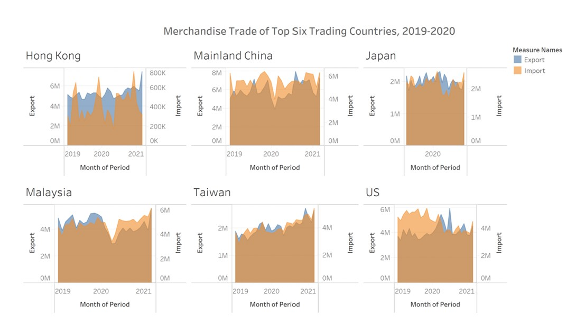

```{r setup, include=FALSE}
knitr::opts_chunk$set(echo = FALSE)
```

## 1.0 Critique and suggestions

The above picture shows the original data visualization.

### 1.1 Clarity
**1. The scales of dual axis charts are arbitrary and may mislead the readers about the relationship between two data series.** All the six charts have two y axis, one stands for Export another one stands for Import. However, they have different range not only between Export and Import, but also between different charts. Take Hongkong and Mainland China as an example, on the one hand, the Export of Hong Kong end with 6M while the Mainland China end with 8M. On the other hand, the Import part is more obvious to view this problem in these two regions. The unit of Hongkong is “k” (Thousand) dollars while the unit of Mainland China is “M” (Million) dollars. We can use combined axis instead of dual axis.

**2. The tick mark of Japan axis is not consistent with other graphs.** Because the graph of Japan was zoomed out in the dashboard, it only shows 2020 in the graph. Actually, the data series of Japan in this graph is accurate, as it shows the same time range with other graphs (from 2019 to 2021, this is also a problem, I will mention this later). However, the graph of Japan will give readers an illusion that this graph only contains the data of 2020 and they may think “is the other data lost?” To address this problem, we can zoom in the graph of Japan in the dashboard.

**3. The title of the graph is problematic.** If we open the origin dataset and order the data, we may find the top six trading regions are not these six places. This will be misleading to the readers as they may treat these six regions as the top trading regions from 2019 to 2020. Hence, the title should delete the word “Top”.

**4.The data range for these six graphs are from 2019 to 2021 not from 2019 to 2020.** The title specifies the range of the data series from 2019 to 2020, but when I try to draw the same picture, I found these six graphs wrongly included the data from 2019 to 2021. This can also help us to explain why we can find 2021 in the tick marks of x axis. To keep pace with the title, we need to re-filter the range of year to 2019-2020.


**5. The name of the x axis is not precise.** The name of x axis should not be “Month of Period” as the tick mark for x axis is year. Instead, we can rename it as “Year” or change the tick marks’ interval as months.

**6. Lack of data source part.** At the bottom of the whole dashboard, there is no data source for readers to check. This part should be added to make the whole visualization completed.

### 1.2 Aesthetics
**1. The location of the title for each graph is not appropriate.** The title of each graph in the dashboard is far left. The layout of the title is not beautiful because it exceeds the main graph. It is better to make the title centered or with a certain amount of space before typing the region name.

**2. The location of the title for dashboard is not aesthetically pleasing.** The title of the dashboard is adjusted as “Center”. However, it is not pleasing because it looks like the title is slightly to the right as the whole picture and it does not keep the balance of the whole dashboard. For this reason, we can put the location of the title as “Left”.

**3. The size of each graph in the dashboard are not the same.** The graph of Mainland China and Malaysia look much bigger than other graphs and the graph of Japan seems like the smallest one. The graphs with different size in the dashboard are problematic and readers may perceive the subtle difference easily.

**4. The dual-scaled axes chart is difficult to directly recognize the data and intuitively make right judgements about the graphs.** Although the two data series (Export and Import) with the same measures (million dollars), they have different magnitudes.

**5. The borders of the graph are not obvious.** In all these six graphs, the Export and Import are overlapped with different colors. However, without the borders added, it cannot view clearly. So, we can add borders by clicking color in the Tableau. In the effects of the color tab, we can choose the border color.

## 2.0 Proposed Visualization

The proposed design is shown above.

### 2.1 Clarity
**1. The whole dashboard is clear and completed.** First of all, the title of the proposed visualization is “Merchandize Trade of Six Trading Regions, 2019-2020”. Secondly, at the bottom of the dashboard is the source part. This makes the whole dashboard completed.

**2. Combined axis is clearer to read.** Instead of using dual axis chart, I decide to merge export and import into a single axis. In this way, readers can distinguish the tick marks more easily.

**3. Unify the y axis’s tick marks of six graphs.** It is not difficult to distinguish that the tick marks of y axis in each graph are the same. It enables readers to compare the export or import values from different regions directly.

**4. The contents and the title of the dashboard keep consistent.** Unlike the original dashboard, the contents contain the data from 2019 to 2021 while the title only contains 2019 and 2020, I filter out the data of 2021 and only remain data of 2019 and 2020 then keep the title as the same of what I filter here.

**5. Add horizontal bar charts in the dashboard.** The charts show two year of total values for export and import respectively. Each horizontal bar chart aims to compare the total values in 2019 and 2020 of different regions. Readers can find the top k export/import regions from these two graphs.

### 2.2 Aesthetics

**1. Still use area charts to visual the export and import.** Using area charts, we can get an approximate idea of the difference between export and import for the period by visually subtracting the smaller area in the graph.

**2. The title for each sheet and title for dashboard are well placed.** This looks much beautiful than the original ones.

**3. Each sheet is well organized and presented in the dashboard.** I try to make all the sheets in the dashboard as the same size and make them display all the contents. There are no contents hided by accident.

**4. The bar charts are ordered by descending order.** This makes readers view the rank of the region easily.

## 3.0 Proposed Visualization

Please view the interactive visualisation on Tableau Public [here](https://public.tableau.com/app/profile/linli.zhong/viz/makeover1_16222975995010/Dashboard1)

## 4.0 Step-by-step Guide

### 4.1 Preparation
1. When we open the original excel file, we may find there are some unnecessary columns and rows. Firstly, we need to create a new spreadsheet, then copy and paste the contents we need into two sheet and rename these two sheets as “Import” and “Export”.
{width=80%}
2. However, for column A, all the region names are along with units “Million Dollars”. In order to remove the unit for each region name, we need to insert a new column before column B (1976 Jan). Then we use a formula “=LEFT(A2,FIND("(",A2)-1)” to help us remove the part “(Million Dollars”). And we rename it as “Region”. We can create one more column before column 1976 Jan, and copy paste the whole column B (Region) and choose the paste type as “Values”. After this, we can delete the column A (Variables) and Column B (Region). We need to repeat the above process for sheet “Export”. Then we can save this excel with the name “Import_Export”.
{width=80%}
3. As long as we finish the preparation work, we can load Tableau to start the visualization work. To start with, we need to import the excel file. Then in the DataSource, we need to drag sheet “Export” to the panel. In the table part, we need to select all the year columns and right click to select the “Pivot”.
{width=80%}
4. Now we need to rename and change the data type of the columns. Rename “Pivot Field Names” as Date and change the data type as “Date”. Then rename “Pivot Field Values” as “Export Values” and change the data type as “Number (whole)”.
{width=60%}
{width=60%}
5.	Join the “Import” table with “Export” table. Drag the “Import” table into the panel, and then repeat step 3 and 4 to pivot, rename, and change the data type of the “Import” table. To distinguish two tables, we need to name the columns as different column names. Here we name the date column as “Date2” and the value column as “Import Values”. So far, we need to define the relationship between “Export” and “Import” tables. Apart from the Region column from different tables which the system defined for us automatically, we need to add one more condition, which is to connect the two date of the tables. Now we finish all the pre-work for visualization.
{width=60%}

### 4.2 Visualization for area charts
1. Filter year of 2019 and 2020. Drag the [Date] into filter, choose year in the filter filed, then click next. Select 2019 and 2020.

{width=60%}

2. Filter the [Region]. Here we take Mainland China as an example. Here we drag the [Region] into the filter, then tick the Mainland China and click ok.
{width=60%}

3. Drag [Export Values] and [Import Values] into Rows.
{width=60%}

4. In the left-hand-side of the picture, drag the part of [Import Values] into [Export Values] to make it in the same y axis. Then we may find the columns and rows changed like the picture shown below.

{width=70%}

5. Drag the [Measure Names] from Columns to Color.

{width=70%}

6. Go to the Analysis and turn of the Stack Marks.

{width=30%}

7. Take [Date] into the Columns and set it as continuous by clicking the second Month in the drop-down list.

{width=30%}

8. Take the graph type as Area charts.

{width=20%}

9. Swap the colors of [Import Values] and [Export Values]. Then add the border color for the graph.

{width=70%}

10.	Double click the left-hand-side of the picture then edit the Axis. As we would like to make six maps with the same tick marks, we need to define the Fixed end as “8,000,000” and Tick Makrs interval as “1,000,000”.

{width=40%}
{width=45%}

11. Click the title and name it as “Mainland China”, and set a proper position for the title to make the whole graph looks good.

{width=70%}

12. Create graphs for other five regions. Right click the Mainland China sheet and click Duplicate to increase our work efficiency. Change the region name from the filter. Repeat this operation for several times until all the six regions graph are created.

{width=40%}

### 4.3 Visualization for horizontal bars
1. Drag [Date] and [Region] into filter part. For [Date], we need to include 2019 and 2020. For [Region], we need to include all the six regions all together.

{width=25%}

2. Drag [Export Values] and [Region] into Columns and Rows respectively.
{width=60%}

3. Drag [Region] into Color and [Export Values] into Lable. Then Click “Sorted descending by sum of Export Values with Region”.

{width=80%}

4.	Set the title name as “Export Data in 2019 and 2020”.

5.	Repeat the 1-4 process to get a sheet for import.

{width=80%}

### 4.4 Dashboard
1. Drag all the sheet into the canvas and make all of them fit the entire view.
2. Adjust the size and the position of each sheet.
3. Add the title name as “Merchandise Trade of Six Trading Regions, 2019-2020”.
4. Add source: Dashboard -> Object -> Drag Text at the bottom of the dashboard. Add "Source: Merchandize Trade by Region/Market, https://www.singstat.gov.sg/find-data/search-by-theme/trade-and-investment/merchandise-trade/latest-data".

## 5.0 Derived Insights

{width=80%}

**1.Bar charts:** In 2019 and 2020, Mainland China exported (141M million dollars) and imported (132.3M million dollars) around these six regions. Hong Kong exported in the second place in 2019-2020, but imported the least values compared with other regions and the value of Hong Kong exported was more than 14 times than imported. Malaysia ranked the second and third place while the United States ranked third and fourthe place in import and export respectively. Both the import and export of Japan is the fifth place with 48.7M and 51.4M million dollars respectively. Although Taiwan exported least with 47.4M, it imported 94.2M million dollars and ranked fourth in these six regions.

**2. Mainland China:** the export experienced a constent decrease from Descember 2019 to Feburary 2020, then it increased gradually until August 2020. Similarly, in the August 2019 and August 2020, export merchandize trade in China decreased, then increased in October. The most marked decrease in import values appeared from November 2019 (6.389M million dollars) to February 2020 (3.979M million dollars). Both the import and export reached the lowest point in February 2020 affected by the combined effects of an extended Lunar New Year holiday and COVID-19 that disrupted the output and the supply chain. But after February 2020, both the export and import activity gradually returned to normal.

**3. Malaysia:** the export had been through a sharp decline in the year of 2020. Compared with the same period of 2019, the total value of merchandise trade of all the months in 2020 decreased. Compared with the export trade, the import trade in Malaysia has not been affected much by covid-19 in 2020.

**4. United States:** the export trade in US overally rised in 2020. It experienced three increase, January 2020 to April 2020, June 2020 to July 2020, August 2020 to December 2020 respectively. However, the import values decreased in 2020 except a slightly increase from February 2020 to March 2020, May 2020 to June 2020, and August 2020 to October 2020.

**5. Hong Kong:** because Hong Kong is a free port and does not levy customs tariffs on import, impose tariff quotas or surcharges and there is no system of value added tax or equivalent, it becomes a trading hub. This means Hong Kong is an important gateway between China and the rest of the world. So it is not difficult to understand the export is much greater than the import in this region. Besides, the export of Hong Kong kept steadily increase from May 2020 to December 2020.

**6. Taiwan:** unlike Hong Kong, Taiwan shows a different pattern between export and import. The import of Taiwan was two times more than its import. There is no significant change for import and export in 2019-2020 even the period of covid-19. Meanwhile, we can find a gradual increase in 2020.

**7. Japan:** the difference of import and export is not significant in Japan. Both the import and export in 2019-2020 remained steadily in this country. 

## 6.0 Reference

1. [Why not to use two axes, and what to use instead](https://blog.datawrapper.de/dualaxis/)

2. [China Jan.-Feb. imports and exports drop dragged by coronavirus disruption](https://news.cgtn.com/news/2020-03-07/China-Jan-Feb-imports-and-exports-drop-due-to-coronavirus-disruption-OEWZfoIWn6/index.html)

3. [Choosing the right chart type: Line charts vs Area charts](https://www.fusioncharts.com/blog/line-charts-vs-area-charts/)

4. [Understanding the Hong Kong customs and trade environment](https://customs.pwc.com/en/territories/hongkong.html)