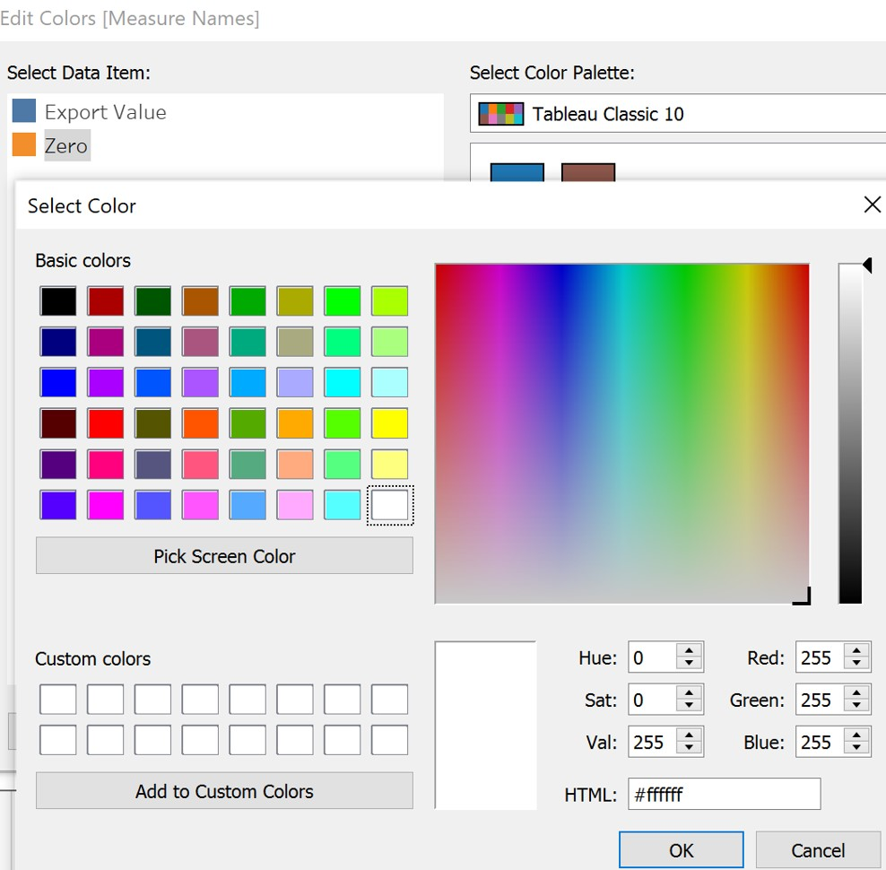

```{r setup, include=FALSE}
knitr::opts_chunk$set(echo = FALSE)
```

## 1 Introduction
The original data visualization is from [Department of Statistics, Singapore](https://www.singstat.gov.sg/modules/infographics/singapore-international-trade). The data used in this graph is available in [Merchandise Trade by Region/Market](https://www.singstat.gov.sg/find-data/search-by-theme/trade-and-investment/merchandise-trade/latest-data).

This visualization graph shows us ten merchandise trading partners of Singapore in 2020. We can find China has the largest total trading values while Thailand has the lowest total trading values from this graph. Meanwhile, we know Taiwan is the top net importers while Hong Kong is the top net exporters. However, this bubble chart is not good enough. In this makeover, I will criticize this graph and make an alternative graph to tell the story.

<center>

{width=50%} 

</center>

## 2 Critique and Suggestions
### 2.1 Clarity
**1. The center point (white circle) of the bubble is hard to judge which section it belongs to.** For example, readers can hardly distinguish Mainland China, EU, and Republic of Korea is “net exporter” or “net importer” with naked eyes. It is better to build another chart to visual the section of the market.

**2. Notes in the blue box is irrelevant with the visualization.** The title of this graph is about data in 2020, but the notes in blue box discuss the trade partners’ changes since 2009 and 2006. The notes in this box should be deleted because we cannot capture any trend over year for Mainland China and United States in this graph.

**3. There is no data source for reference.** Data source at the bottom of the graph is needed to make sure the visualization is reliable and readers can check data as they wish. Data source part should be added to make the whole visualization completed.

**4. The bubble chart tries to show too much content.** For instance, this graph tries to show the value of export, import, and total value. Besides, it wants readers can visual the partner is a net importer or net exporter, and at the same time it wants to highlight the top net importer and net importer. I would like to suggest adding one more chart to help this bubble chart show stories.

**5. No rank number in the annotation or tooltip.** Readers need to count the rank by reading all the value for each partners. This is not user-friendly. So adding the rank number in annotation or tooltip is necessary.

### 2.2 Aesthetic
**1. One color use for two categories.** For visualization, we should use different colors for different categories. However, purple is repeatedly used for Thailand and EU. This ambiguity should be solved by using different contrast colors for different partners.

**2. The color is opaque and the size of the bubble is no need to be so big.** Because of the inappropriate size, some partners are even overlapping together formed as clusters. Besides, the opaque bubbles make Readers hardly find the borders without clicking one specific circle. Adjusting opacity and size is necessary to separate different partners visually.

**3. Annotations for “Top Net Exporter” and “Top Net Importer” are not obvious.** Some readers even do not notice this annotation in the graph because this graph is already colorful. Alternatively, adding the rank for "Net Importer" and "Net Exporter" in the annotation of each bubble can solve this problem.

**4. The tooltip in the bubble chart is randomly placed.** The location of the tooltip didn't follow the general rule of thumb. We in all four directions (left, right, ups, downs) of the bubbles are placed the tooltips. Readers cannot find the tooltip with the same color as bubble briefly. We need to place the tooltip at a pleasing position, for example put it in the center of the bubbles.

## 3 Proposed Visualization
### 3.1 Sketch
The proposed design is shown below.

<center>


{width=80%} 

</center>

### 3.2 Advantages
**1. The visualization is divided into three parts; each graph tries to show a single story.** For example, bubble graph tries to show the total value (export + import) for different partners; Line & charts tries to show the trend for all or one single partner over years; Butterfly charts tries to show difference (|export – import|) and to judge the partner is a net importer or net exporter.

**2. The opacity of color is well adjusted.** To improve the quality of visualization, the color is carefully picked to avoid repeated colors in bubble chart. Apart from that, I try to keep the same tone for the same dimension in different graphs.

**3. Make the graph interactive and animative.**To allow more meaningful insights, tableau dashboard interactive actions will be added in the visualization. Readers can click one part of the graph and get highlight or filter in other graphs. Meanwhile, animation function will also be added in the graph.

**4. Useful tooltip will be added for each graph.** In each graph, I will create some calculation field to calculate the difference, absolute difference, rank and so on. Besides, in the butterfly chart, I will use the created calculation to judge the partner is a net importer or net exporter. The result will be added in the tooltip.

## 4 Proposed Visualization
Please view the interactive visualization on Tableau Public.

<center>

{width=100%} 

</center>

## 5 Step-by-Step Guide
### 5.1 Data Preparation
1. Open the data file in excel, filter out ten countries and regions in the given graph. 

  <center>

{width=80%}

</center>


2. Create a new excel file named [Export_Import], paste the data into the worksheets of “Export” and “Import” separately.

<center>

{width=50%}

</center>

3. Delete the data which is not between Jan 2011 and Dec 2020. 

<center>

{width=80%}

</center>
 

4. To keep the unit number as the same, insert a new row under European Union(Million Dollars) and name it as “EU(Thousand Dollars)”. Set the formula “=B2*1000”. Drag the formula till December 2020. Copy and paste the “EU(Thousand Dollars) only in numbers. Repeat the above operation in Import sheet. Save the file. 

<center>

{width=80%}

</center>


5. Open Tableau, drag Export sheet into the panel. Select all the columns except variables, then click “Pivot”. For Variables, right click then click “Split”. Rename the column name (Split -> Market, Pivot Filed Name -> Date, Pivot Field Value -> Export Value(Thousand Dollars)). Then change the data type (Date: String -> Date, Export Value: String -> Number (whole)). Hide column of Variables.

<center>

{width=40%}

</center>


6. Create a new Calculated Field named “Export Value”. 
The formula is “[Export Value(Thousand Dollars)]*1000”. Click ok and hide the column “Export Value (Thousand Dollars)”. 

<center>

{width=50%}

</center>


7. Drag Import sheet into panel, repeat process 5 and 6.

<center>

{width=50%}

</center>


8. Double click the line between table "Export" and "import". Add join relationship Date = Date2.

<center>

{width=50%}

</center>


### 5.2 Bubble Plot
1. Drag Import Value and Export Value into Rows and Columns respectively.

<center>

{width=60%}

</center>

  
2. Create a calculated value called Total Value. It equals Export Value + Import Value.

<center>

{width=50%}

</center>

3. Drag [Market] into Color, Total value into Size. Then change the type from Automatic into Circle. Then adjust the size and Opacity of the bubble plot.

<center>

{width=30%}

</center>

4. Drag Total value into Label. Edit the format of label “Total Value”. Customized it as currency with units (B). Besides, set the format of [Export value] and [Import Value] with Billions.

<center>

{width=40%}

</center>

5. Drag [Date] into filter and choose it as year. Then right click it and select “Show Filter”. Set the filter as multiple values in dropdown list.

<center>

{width=50%}

</center>

6. Create a new calculation variable called [Total Value Rank]. Then drag it into tooltip with computing use [country].

<center>

{width=50%}

</center>

7. Edit the layout and color of tooltip, and add title name for this graph. 

<center>

{width=85%}

</center>

### 5.3 Bars & Line
1. Drag [Date] into columns, [Import Values] into Rows. Then drag [Export Values] in the left hand side of the graph to make [Import Values] and [Export Values] use the same axis.

<center>

{width=70%}

</center>

2. Drag [Total Value] into rows, then right click it and choose “Dual Axis”.

<center>

{width=60%}

</center>

3. In the right-hand side of the y axis, right click the axis and choose “Synchronize Axis” to make both sides of the y axis have the same tick marks.

<center>

{width=30%}

</center>

4. Change the graph type of “Measure Values” into Bars and turn off the Stack Marks.

<center>

{width=60%}

</center>

5. Drag [Measure Names] into Size and adjust the Measure Names Color.

<center>

{width=70%}

</center>

6. In the upper side of the graph, right click the date and choose “hide field labels for columns” to make the graph looks better.

<center>

{width=60%}

</center>

7. Right click the right-hand side of the y axis, uncheck “Show Header”.

<center>

{width=55%}

</center>

8. Drag [Country] into filter and show filter.

<center>

{width=70%}

</center>

9. Set the title of the graph.

<center>

{width=40%}

</center>

### 5.4 Butterfly Chart
1. Create calculated field: zero.

<center>

{width=50%}

</center>

2. Drag [Export Value], [Zero], [Import Value] into columns, [Market] into rows.

<center>

{width=70%}

</center>

3. Select [Zero] in columns and choose “Dual Axis” to merge [Export Value] and [Zero] into one graph.

<center>

{width=70%}

</center>

4. Change [Export Value] from automatic into bars and edit the axis to make the scale reversed.

<center>

{width=70%}

</center>

5. Create a new calculated field called [Difference] to calculate the difference between export and import.

<center>

{width=50%}

</center>

6. Create a new calculated field called [Abs] to get the absolute value of the difference.

<center>

{width=50%}

</center>

7. Change the graph type of [Zero] from automatic to text, then drag [Abs] into text. Right click zero axis and choose synchronize axis.

<center>

{width=70%}

</center>

8. Edit axis of [Zero], change the range from automatic into fixed. Adjust the fixed start to 0, fixed end into automatic.

<center>

{width=50%}

</center>

9. Edit the format of [Abs]. Set the number as Billions (B) with two decimals.

<center>

{width=40%}

</center>

10. Edit color of [zero] into black and make it bold.

<center>

{width=40%}

</center>

11. For [Import Value], repeat the process from 7 to 10.

<center>

{width=70%}

</center>

12. Create a new calculated field called [Net Exporter/Net Importer]. As the [Difference] is [Export Value] – [Import Value], the market will be a net exporter if the difference is greater than 0, else it will be a net importer.

<center>

{width=50%}

</center>

13. Drag [Net Exporter/Net Importer] into color and adjust the color settings.

<center>

{width=70%}

</center>

14. Drag [Export Value] and [Import Value] into Label separately and adjust the Label settings.


<center>

{width=30%}

</center>

15. Drag [Date] into filter and show filter.

<center>

{width=70%}

</center>

16. Create a new calculated filed called [Exporter/Importer Rank] to calculate the rank of each market separately based on the category (Net Exporter/Net Importer).

<center>

{width=75%}

</center>

17. Drag [Exporter/Importer Rank] into tooltip. Set the font and color for the tooltip.

<center>

{width=50%}

</center>

### 5.5 Dashboard
1. Create a new dashboard. Set the size as automatic. Drag three graphs created above into the dashboard. And set the title of the dashboard.

<center>

{width=50%}

</center>

2. Add actions “Market Highlight” for this dashboard. Uncheck the “Bars&Lines” and set highlight conditions as “Market”. And make run this action on hover.

<center>

{width=40%}

</center>

3. Add Action “Filter by Region” to filter the region in the whole dashboard. When clicking on one market in Bubble plot or Butterfly chart, it will automatically filter the trend of this market.

<center>

{width=40%}

</center>

4. Add action “Filter by year” to filter the year in the dashboard. When click one single year in “Bars&Lines”, other two charts will be filtered by this year automatically.

<center>

{width=40%}

</center>

6. Add notes and source at the bottom of the dashboard.

<center>

{width=60%}

</center>

## 6 Derived Insights
1.	Trend: the merchandize trends for all these ten countries kept steady except a slightly decrease from 2014 to 2016 and a steady increase from 2017 to 2018. In each year, these ten partners exported more than they imported from Singapore. 

<center>

{width=75%}

</center>

2.	Net Exporter/ Net Importer: Hong Kong, Indonesia, Mainland China, and Thailand are net exporters, while EU, Japan, and Taiwan are net importers from 2011 to 2020. For United States and Republic of Korea, they became net exporters since 2020 and 2017 onwards respectively. For Malaysia, it became a net importer since 2019. Hong Kong has always been the top net exporter from 2011 to 2020. As for the top net importer, it was occupied by US (2011-2017) and Taiwan (2018-2020).

<center>

{width=75%}

</center>

3.	Total merchandize trade value: Mainland China’s total merchandize trade value ranked first since 2013 onwards. Before 2013, the first place belongs to Malaysia. Besides, the gap between Mainland China and Malaysia was getting bigger when Mainland China catches up with Malaysia.

<center>

{width=60%}

</center>

