```{r setup, include=FALSE}
knitr::opts_chunk$set(fig.retina = 3,
                      echo = TRUE, message = FALSE, error = FALSE, 
                      warning = FALSE)
```

## 1. Overview
### 1.1 Background
GAStech is a natural gas production company in an island country of Kronos in the past twenty years. It builds strong relationships with the government of Kronos but low environment stewardship. In January 2014, when celebrating the success fortune by IPO (initial public offering), several employees of GAStech went missing. 

This post is focused on [VAST Challenge 2021 Mini-Challenge 2](https://vast-challenge.github.io/2021/MC2.html). Mini-Challenge 2 provides useful data of missing employees’ relevant information, a list of vehicle assignments by employee, vehicle tracking data, loyalty card transaction data, credit and debit card transaction data, and a tourist map of Abila. In this post, I will make use of R language to visual and analyze available data and identify the suspicious activity of the employees.

### 1.2 Literature review

The task of Mini Challenge 2 in 2014 was to find unusual patterns in employees’ daily lives from their credit/debit/loyalty card records and the GPS tracking records of their cars. In this article, I mainly refer to two works by Central South University and KU Leuven.

For Central South University, they used D3, MySQL, Excel as their visualization tools. They first identified daily routines for GAStech employees. They divided these missing employees into general staffs and truck drivers. Then they discuessed these two groups separately. They detected suspicious activities by visualization the credit card and gps data.

For KU Leuven, they had three stages to visualize. (1) Aggregate & Slice, (2) Design, Filter & Analyze and (3) Communicate. They first made full use of R to test their hypothesis. Then involved the design and implementation of streamlined tools to optimize the identification of specific patterns. After that, they presented and visualized the results.


## 2. Data Preparation
### 2.1 Install and load packages
The code chunk below is to check required packages are installed or not, if they are not installed, the code chunk will help install them automatically. After all packages are installed, the code chunk will load them.

```{r}
packages = c('igraph','ggraph','visNetwork','lubridate','dplyr',
             'clock','tidyverse','DataExplorer','gplots','plotly',
             'ggplot2','superheat','tm','plotly','lattice','GDAdata','raster',
             'sf','tmap','foreign','gifski','rgdal','tiff','sp','leaflet',"DT"
             )
for(p in packages){
  if(!require(p, character.only = T)){
  install.packages(p)
  }
  library(p,character.only = T)}
```

### 2.2 Import relevant data
The data is stored in MC2 file. Read_csv()is to import four csv files into R. "Windows-1252" is a single-byte character encoding of the Latin alphabet for value "Katerina’s Café".

```{r}
cc<- read_csv("MC2/cc_data.csv",locale = locale(encoding = "windows-1252"))
lyt<-read_csv("MC2/loyalty_data.csv",locale = locale(encoding = "windows-1252"))
gps <-read_csv("MC2/gps.csv")
car<-read_csv("MC2/car-assignments.csv")
```

### 2.3 Data preparation

**1. Change data type.** The code chunk below is to convert id in gps from number to factor, last4ccnum in cc from number to character and timestamp in gps, loyalty, and credit card from character data type to Datetime format.

```{R}
gps$id<-as.factor(gps$id)
car$CarID<-as.factor(car$CarID)
cc$last4ccnum<-as.character(cc$last4ccnum)
gps$Timestamp<-date_time_parse(gps$Timestamp,zone = "",format = "%m/%d/%Y %H:%M:%S")
lyt$timestamp<-date_time_parse(lyt$timestamp,zone = "",format = "%m/%d/%Y")
cc$timestamp<-date_time_parse(cc$timestamp,zone = "",format = "%m/%d/%Y %H:%M")
```

**2. Combine data.** The code chunk below is to combine first name and last name of employee together in the list of car.

```{r}
car$Name<-paste(car$FirstName,car$LastName)
```

**3. Add additional column.** When analyzing the car assignment csv file, we may notice that the GAStech does not assign specific company truck for each truck driver, but this is not a case for other employees with title which is not truck driver. Hence, we can divide missing employees into two types, one is general employees, another one is truck driver, to further investigate their suspicious activities. Besides, add additional column for car type, and there are two types of cars, one for company truck another one for company car.

```{r}
car$Category<-ifelse(car$CurrentEmploymentTitle == "Truck Driver", 
                       "Truck Driver","General Staff")
gps$car_type<-ifelse(gps$id %in% c('101','104','105','106','107'),'Company truck',
                     'company car')
```

The code chunk below is to extract day of the timestamp and add it in column called "day" in each file.

```{r}
cc$day<-get_day(cc$timestamp)
lyt$day<-get_day(lyt$timestamp)
gps$day<-get_day(gps$Timestamp)
```

## 3. MC2 Visualization Preparation
### 3.1 Question 1 

The code chunk below is to create bar chart to find out the popular location for both credit card and loyalty card.

```{r}
p1<-plot_ly(data = cc, x = ~location, marker = list(color = 'rgb(158,202,225)',
                           line = list(color = 'rgb(8,48,107)', width = 1.5)))
p1 <- p1 %>% layout(title = "Frequency of each location by credit card",
                                      xaxis = list(title = "",
                                                   tickfont = list(size = 10)),
                                      yaxis = list(title = "count",
                                                   tickfont = list(size = 10),
                                                   range = c(0,220)))

p2<-plot_ly(data = lyt, x = ~location, marker = list(color = 'rgb(158,202,225)',
                           line = list(color = 'rgb(8,48,107)', width = 1.5)))
p2 <- p2 %>% layout(title = "Frequency of each location by loyalty card",
                                      xaxis = list(title = "",
                                                   tickfont = list(size = 10)),
                                      yaxis = list(title = "count",
                                                   tickfont = list(size = 10),
                                                   range = c(0,220)))
p1
p2
```

From the graph generated above, I filter 4 locations, these are Katerina’s Café, Hippokampos, Guy's Gyros, Brew've Been Served to compare with each other and find out when are they popular.

```{R}
cc1<-cc%>%
  filter(location == "Katerina’s Café"|
         location == "Hippokampos"|
         location == "Guy's Gyros"|
         location == "Brew've Been Served")
p2<-ggplot(data = cc1, aes(x=day, fill = location))+
  geom_bar() + scale_fill_brewer(palette="Accent")+
  ggtitle("Popular location by day")
ggplotly(p2)
```

```{r}
location_by_day <- cc1 %>%
        ggplot(aes(x = day, fill = location)) +
        geom_bar() +
        labs(title = "popular locations' transaction by day",
             x = "", y = "") +
        facet_wrap(~ location, ncol = 2, scales = "free_y")+
  scale_fill_brewer(palette="Accent")
location_by_day_plotly <- ggplotly(location_by_day) %>% 
        layout(yaxis = list(title = list(text = "Frequence", standoff = 20L)))

location_by_day_plotly<-location_by_day_plotly%>%
  layout(title = "Transaction frequency per location per day",
         xaxis = list(title = "",
                      tickfont = list(size = 10)),
                      yaxis = list(title = "count",
                      tickfont = list(size = 10)))
location_by_day_plotly
```

Below code chunk is to find out anomalies from credit card. I would like to investigate suspicious transaction time and less popular locations.

```{R}
cc2<-cc
# create breaks
breaks <- hour(hm("00:00", "5:59", "11:59", "17:59", "23:59"))
# labels for the breaks
labels <- c("Night", "Morning", "Afternoon", "Evening")
cc2$Time_of_day <- cut(x=hour(cc2$timestamp), 
                       breaks = breaks, 
                       labels = labels, include.lowest=TRUE)
cc2$date_time<-paste(cc2$day,cc2$Time_of_day)

p3<-ggplot(cc2, aes(date_time, location)) + 
  geom_bin2d() + theme(axis.text.x = element_text(angle = 90, hjust = 1))
p3<-p3+scale_x_discrete(limits = c("6 Night", "6 Morning", "6 Afternoon","6 Evening",
                                   "7 Night", "7 Morning", "7 Afternoon","7 Evening",
                                   "8 Night", "8 Morning", "8 Afternoon","8 Evening",
                                   "9 Night", "9 Morning", "9 Afternoon","9 Evening",
                                   "10 Night", "10 Morning", "10 Afternoon","10 Evening",
                                   "11 Night", "11 Morning", "11 Afternoon","11 Evening",
                                   "12 Night", "12 Morning", "12 Afternoon","12 Evening",
                                   "13 Night", "13 Morning", "13 Afternoon","13 Evening",
                                   "14 Night", "14 Morning", "14 Afternoon","14 Evening",
                                   "15 Night", "15 Morning", "15 Afternoon","15 Evening",
                                   "16 Night", "16 Morning", "16 Afternoon","16 Evening",
                                   "17 Night", "17 Morning", "17 Afternoon","17 Evening",
                                   "18 Night", "18 Morning", "18 Afternoon","18 Evening",
                                   "19 Night", "19 Morning", "19 Afternoon","19 Evening"))
p3 <- ggplotly(p3)
p3 <- p3 %>% layout(autosize = F, width = 800, height = 500)
p3<-p3%>% layout(title = "Time of day vs location",
                                      xaxis = list(title = "",
                                                   tickfont = list(size = 8)),
                                      yaxis = list(title = "",
                                                   tickfont = list(size = 8)))

```

```{r fig.height = 5, fig.width = 5}
p3
```

### 3.2 Question 2 

**Add the vehicle data to your analysis of the credit and loyalty card data. How does your assessment of the anomalies in question 1 change based on this new data? What discrepancies between vehicle, credit, and loyalty card data do you find? Please limit your answer to 8 images and 500 words.**

The below code chunk is to visual the movement patter by company cars and company trucks, and they are faceted by employment type and truck car id respectively.

```{r}
gps1<-gps %>%
  filter(!str_detect(gps$id, '101'),
         !str_detect(gps$id, '104'),
         !str_detect(gps$id, '105'),
         !str_detect(gps$id, '106'),
         !str_detect(gps$id, '107'))
gps1<-left_join(gps1, car, by = c("id"="CarID"))

p4 <- ggplot() +   
      geom_point(data = gps1, 
                   aes(x = long, y = lat,color = CurrentEmploymentType), 
                   size = 0.4)+
      facet_grid(day~CurrentEmploymentType) + theme_bw()
```

```{r fig.height = 10, fig.width = 12}
p4 <- p4+ ggtitle(label = "Movement Patterns by Employment Type",
                  subtitle = 'By company cars')+theme(
  plot.title = element_text(color = "black",size = 20, face = "bold"),
  plot.subtitle = element_text(size = 15))
p4
```

```{r fig.height = 8, fig.width = 10}
gps2<-gps %>%
  filter(gps$car_type == "Company truck")

p5 <- ggplot() +   
      geom_point(data = gps2, 
                   aes(x = long, y = lat,color = id), 
                   size = 0.4)+
      facet_grid(day~id) + theme_bw()
p5 <- p5+ ggtitle(label = "Movement Patterns by Car ID",
                  subtitle = 'By company trucks')+theme(
  plot.title = element_text(color = "black",size = 20, face = "bold"),
  plot.subtitle = element_text(size = 15))
p5

```

In order to find out the discrepancies between vehicle, credit and loyalty card data, I draw a heatmap to visual the night activity from gps dataset.

```{r}
gps3<-gps
gps3$Time_of_day <- cut(x=hour(gps3$Timestamp), breaks = breaks, labels = labels, include.lowest=TRUE)
gps3$date_time<-paste(gps3$day,gps3$Time_of_day)
gps3<-gps3%>%
  filter(gps3$Time_of_day == "Night")

p6<-ggplot(gps3, aes(date_time, id)) + 
  geom_bin2d() + theme(axis.text.x = element_text(angle = 90, hjust = 1))
p6 <- p6 + theme(legend.position = "none")
p6 <- ggplotly(p6)
p6 <- p6 %>% layout(autosize = F, width = 800, height = 500)
p6<-p6%>% layout(title = "Suspicious Night Activity Detected by Car ID",
                                      xaxis = list(title = "",
                                                   tickfont = list(size = 8)),
                                      yaxis = list(title = "",
                                                   tickfont = list(size = 8)))

```

```{r fig.height = 5, fig.width = 5}
p6
```

```{r}
#Import raster file
bgmap <- raster("MC2/Geospatial/MC2-tourist.tif")
# import the Abila shapefile
Abila_layout <- "MC2/Geospatial/Abila.shp"
Abila_shape <- readOGR(Abila_layout)
#Plot raster layer
tm_shape(bgmap) +
tm_rgb(bgmap, r = 1,g = 2,b = 3,alpha = NA,
       saturation = 1,interpolate = TRUE, max.value = 255)+
  tm_shape(Abila_shape)+
  tm_lines(col= "grey", lwd=1)
#Import GIS data file
Abila_st <- st_read(dsn = "MC2/Geospatial",
                    layer = "Abila")
#Converting aspatial data into a simple feature data frame
gps_sf <- st_as_sf(gps, coords = c("long", "lat"),crs= 4326)
#Creating movement path from GPS points
gps_path <- gps_sf %>%
  group_by(id, day) %>%
  summarize(m = mean(Timestamp), do_union=FALSE) %>%
  st_cast("LINESTRING")
```

### 3.3 Question 3 

**Can you infer the owners of each credit card and loyalty card? What is your evidence? Where are there uncertainties in your method? Where are there uncertainties in the data? Please limit your answer to 8 images and 500 words.**

Before infer the owners of the credit card an loyalty card, I need to compute the gps data to match the location name in credit and loyalty card with longtitude and latitude and locate its location in map.

The code chunk below is to compute the stay time in one place (same latitude and longitude). Then filter out the data with time difference more than 9,000s (2.5h) to find out the longitude and latitude of company and their home. To make things easier, I round longitude and latitude with four digits in the newly created gps table.

```{r}
gps_track <- read_csv("MC2/gps.csv")
gps_track$id<-as.factor(gps$id)
gps_track$Timestamp<-date_time_parse(gps_track$Timestamp,zone = "",
                                     format = "%m/%d/%Y %H:%M:%S")

gps4<- gps_track
gps4<- dplyr::rename(gps4, arrival_time = Timestamp)
gps4$date<-as.Date(format(gps4$arrival_time, "%Y-%m-%d"))
gps4$day_of_week<-wday(gps4$arrival_time, label=TRUE)
gps4 <- gps4[order(gps4$id,gps4$date,gps4$arrival_time), ]
gps4 <- gps4 %>%
  group_by(id) %>%
  mutate(departure_time = lead(arrival_time))%>%
  mutate(time_difference = departure_time - arrival_time)#%>%
gps4<-gps4%>%
  filter(time_difference >= 18000)
gps4$arrival_time<-format(as.POSIXct(gps4$arrival_time), format = "%H:%M:%S")
gps4$departure_time<-format(as.POSIXct(gps4$departure_time), format = "%H:%M:%S")

gps5<-gps4%>%
  relocate(id,date,day_of_week,arrival_time,departure_time,lat,long,time_difference)

DT::datatable(gps5)%>%
    formatRound(columns=c('long', 'lat'), digits=4)
```

```{r}
gps_sf <- st_as_sf(gps5, coords = c("long", "lat"),crs= 4326)
#Creating movement path from GPS points
gps_path <- gps_sf %>%
  group_by(id, date,day_of_week,time_difference,arrival_time,departure_time)
gps_path_selected <- gps_path# %>%
  #filter(date == "2014-01-07")
tmap_mode("view")
tm_shape(bgmap) +
  tm_rgb(bgmap, r = 1,g = 2,b = 3,alpha = NA,saturation = 1,
       interpolate = TRUE,max.value = 255) +
  tm_shape(Abila_shape)+
  tm_lines(col= "grey", lwd=1)+
  tm_shape(gps_path_selected)+
  tm_dots()
```

We can assume from the above table that (24.8796,36.0480) is the company's location in the map, because on weekdays, employees usually park their cars at this location in the morning and in the lunchtime, they drive to another place then back to this place again. Besides, after careful observation from the data table, I find employees arrive company before 9am and leave company around 12 o'clock in the morning, they eat lunch outside then go back to the office before 2pm and go back home or go shopping somewhere after 5.30pm. So we can filter the data on special time (working hours, midnight) from credit card and gps to infer the owner of the credit card and loyalty card.

The below code chunk is to filter out the midnight transaction data and gps data. I order the newly created credit card table by its timstamp, so that I can find there are 5 transactions are made by midnight. 

```{r}
cc3<- cc 
cc3$date<-as.Date(format(cc3$timestamp, "%Y-%m-%d"))
cc3$timestamp<-format(as.POSIXct(cc3$timestamp), format = "%H:%M:%S")
cc3<-cc3%>%
  relocate(date,day,timestamp,price,location,last4ccnum)
cc3 <- cc3[order(cc3$timestamp,cc3$date), ]
cc3<- cc3%>%
  filter(timestamp>="09:00:00"&timestamp<="12:00:00")
  
DT::datatable(cc3)
```

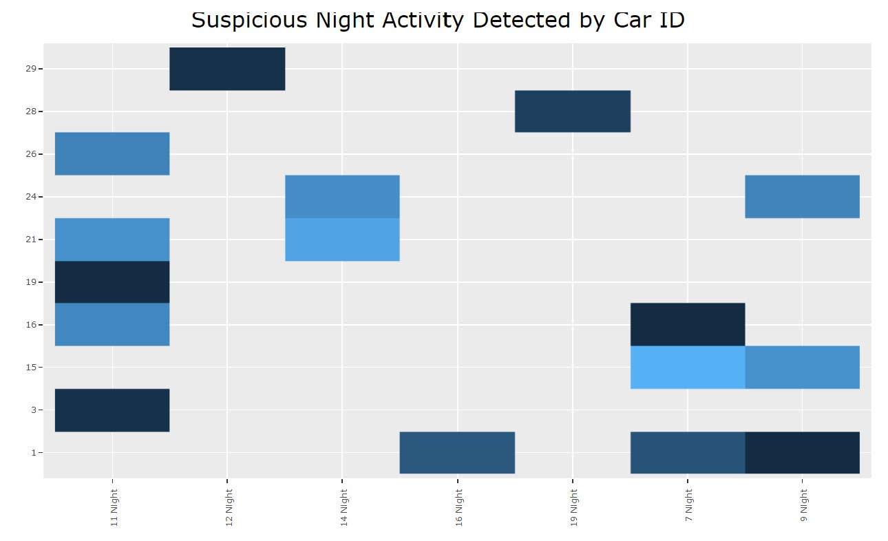{width=110%} 
Becasue the format of timestamp in credit card dataset and loyalty card dataset is different, I try to change the format of credit card table with "%Y-%m-%d". Then I join these two tables and add a new row to check whether the employees use loyalty card or not.

```{r}
cc4<-cc
cc4$timestamp<-format(cc$timestamp,format="%Y-%m-%d")
lyt4<-lyt
lyt4$timestamp<-format(lyt4$timestamp,format="%Y-%m-%d")
cc_lyt<-merge(x=cc4,y=lyt4,all.x = TRUE)
x <-if_else(is.na(cc_lyt$loyaltynum),"No","Yes")
cc_lyt$use_loyalty<-x

suspicious_cc<- c("9551", "8332", "3484","5407","8156")
sus_day <- c(12,13,19)
cc_lyt<-cc_lyt%>%
  filter(day %in% sus_day, last4ccnum %in% suspicious_cc, 
         location == "Kronos Mart")
DT::datatable(cc_lyt)
```


### 3.4 Question 4 

**Given the data sources provided, identify potential informal or unofficial relationships among GASTech personnel. Provide evidence for these relationships. Please limit your response to 8 images and 500 words.**

```{r}

```

```{r}
gps5<- gps_track
gps5<- dplyr::rename(gps5, arrival_time = Timestamp)
gps5$date<-as.Date(format(gps5$arrival_time, "%Y-%m-%d"))
gps5$day_of_week<-wday(gps5$arrival_time, label=TRUE)
gps5 <- gps5[order(gps5$id,gps5$date,gps5$arrival_time), ]
gps5 <- gps5 %>%
  group_by(id) %>%
  mutate(departure_time = lead(arrival_time))%>%
  mutate(time_difference = departure_time - arrival_time)#%>%
gps5<-gps5%>%
  filter(time_difference >= 300 & time_difference <=18000)
gps5$arrival_time<-format(as.POSIXct(gps5$arrival_time), format = "%H:%M:%S")
gps5$departure_time<-format(as.POSIXct(gps5$departure_time), format = "%H:%M:%S")
```

```{r}
gps6<-gps5%>%
  filter(id != "107"& id != "106"&id != "105"&
         id != "104"&id != "101")
gps6<-merge(x = gps6, y = car[ , c("Name", "CarID")], 
            by.x='id', by.y='CarID')
gps_sf <- st_as_sf(gps6, coords = c("long", "lat"),crs= 4326)
#Creating movement path from GPS points
gps_path <- gps_sf %>%
  group_by(Name, id, date,day_of_week,time_difference,arrival_time,departure_time)
gps_path_selected2 <- gps_path #%>%
  #filter(date == "2014-01-11")
tmap_mode("view")
tm_shape(bgmap) +
  tm_rgb(bgmap, r = 1,g = 2,b = 3,alpha = NA,saturation = 1,
       interpolate = TRUE,max.value = 255) +
  tm_shape(Abila_shape)+
  tm_lines(col= "grey", lwd=1)+
  tm_shape(gps_path_selected2)+
  tm_dots()+
  tm_facets(by = "date",ncol = 2)
```

### 3.5 Question 5 

**Do you see evidence of suspicious activity? Identify 1- 10 locations where you believe the suspicious activity is occurring, and why Please limit your response to 10 images and 500 words.**

```{r}
p4<-plot_ly(data = cc, x = ~day, y=~price, marker = list(color = 'rgb(158,202,225)',
                           line = list(color = 'rgb(8,48,107)', width = 1.5)))
p4 <- p4 %>% layout(title = "Total price per day by credit card",
                                      xaxis = list(title = "Day"),
                                      yaxis = list(title = "Total price"))

p5<-plot_ly(data = lyt, x = ~day, y=~price, marker = list(color = 'rgb(158,202,225)',
                           line = list(color = 'rgb(8,48,107)', width = 1.5)))
p5<- p5 %>% layout(title = "Total price per day by loyalty card",
                                      xaxis = list(title = "Day"),
                                      yaxis = list(title = "Total price"))
p4
p5
```

```{r}
p6<-ggplot(cc, aes(x = reorder(location,price), y=price)) + 
    geom_boxplot(color = "deepskyblue4")+
    theme(axis.text.x = element_text(angle = 90, hjust = 1))+
    labs(title = "Single Transaction Price per Location",
             x = "Location", y = "Price")
ggplotly(p6)
```


## 4. MC2 Visualization Insights
### 4.1 Question 1 

**Using just the credit and loyalty card data, identify the most popular locations, and when they are popular. What anomalies do you see? What corrections would you recommend to correct these anomalies? Please limit your answer to 8 images and 300 words.**

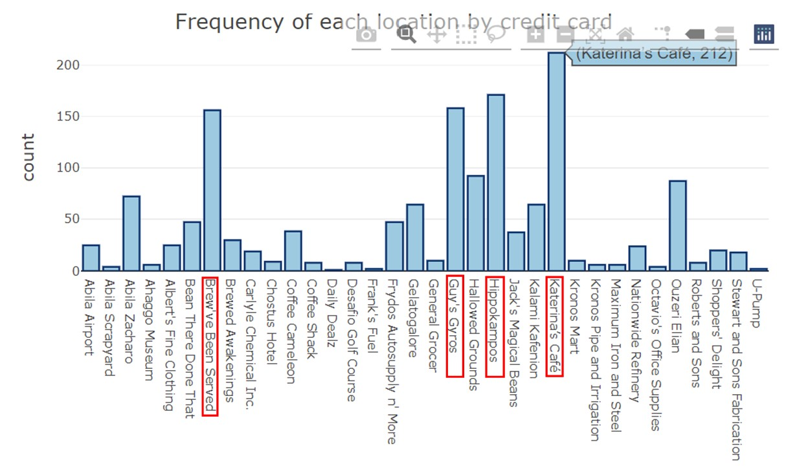{width=110%} 
*Fig1.1 Detect Popular Locations*

Popular locations are detected based on the number of transaction records in credit card. There are 4 locations have more than 150 transactions by credit card from January 6th to 19th. We can mark these 4 locations as popular locations. These four popular locations are *Katerina’s Café, Hippokampos, Guy's Gyros, and Brew've Been Served*. On top of that Katerina’s Café is the most popular location where these 44 missing employees like. 212 and 195 transactions were made by credit card and loyalty card in Katerina’s Café within 14 days. In average, there were around 15 transactions made by credit card per day in Katerina’s Café.

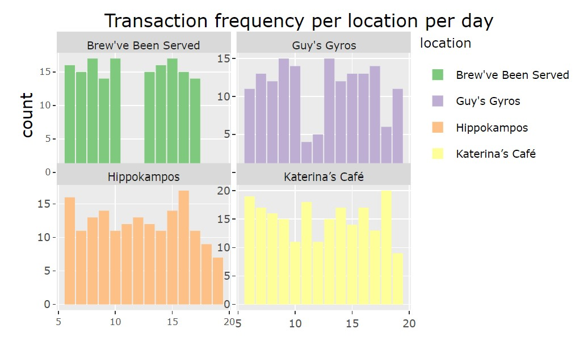{width=110%} 
*Fig1.2 Comparison of Four Popular Locations per Day*

**Brew've Been Served** had three popular days from 6th January to 19th January. These three days are 8th, 10th, and 15th. Meanwhile, it had the same number of transactions (count 17 transactions) by tracing the missing employees’ credit card and loyalty card in these three days. However, on 11th and 12th January, this store didn’t have any transactions with missing employees.

**Guy's Gyros** had two popular days within 14 days on 9th and 13th of January with 15 transactions with missing employees. These two days are around three times of the day on 11th, 12th and 18th with 4, 5, and 6 transactions respectively.

**Hippokampos** also had two popular days on 6th and 16th of January but with different transactions in these two days. on January 6th it received 16 transactions and on January 16th it received one more transaction compared with January 6th. From January 16th to 19th, the overall transaction declined, reaching a 14-day low on the 19th.

**Katerina’s Café** the most popular locations’ popular day was January 18th. It had 20 transactions in that day. But from 6th to 10th January, transaction volume in Katerina’s Café experienced substantially decrease to 11 transactions. Then jumped to 18 transactions and drop back to 11 transactions on January 12th. From 13th to 18th of January the number of transactions fluctuated steadily. On January 19th it plummeted to 9 transactions.

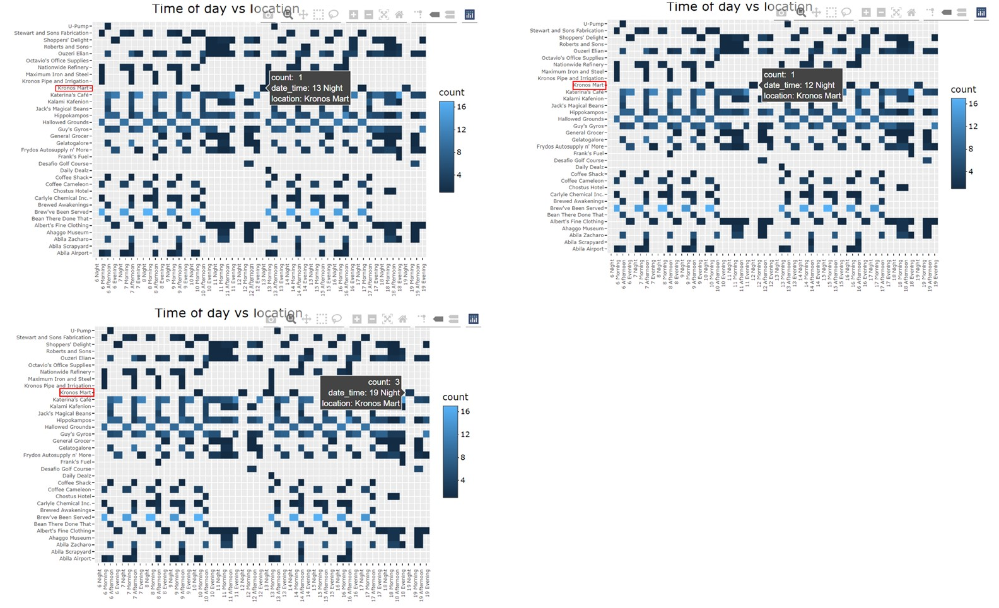{width=110%} 
*Fig1.3 Transaction Records in Credit Card by Time of the Day*

Anomaly 1. At midnight (00.00 to 05.59) there are 5 transactions recored in Kronos Mart. All the transactions at midnight are in this store. I suggest investigating this mart, such as who they made these transactions, when they arrived and depatured at this place.

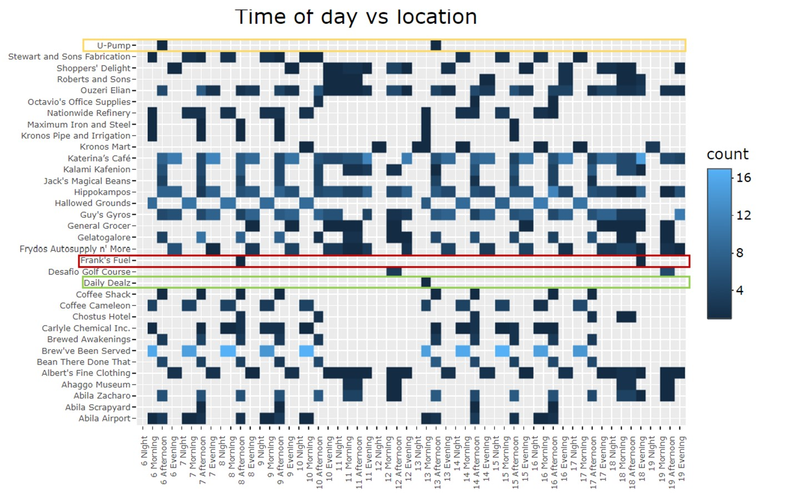{width=110%}
*Fig1.4 Transaction Records in Credit Card by Time of the Day*

Anomaly 2. In the 14 dyas record of credit card, there are 2 transactions made in Frank’s Fuel and U-Pump, and 1 transactions made in Daily Dealz. In general, people are more inclined to spend in stores they are familiar with. I suggest police should investigate the motivation of employees to go to these three place and what they bought. Besides, for Frank’s Fuel and U-Pump, we should investigate whether these two transactions were made by one employee.

### 4.2 Question 2 

**Add the vehicle data to your analysis of the credit and loyalty card data. How does your assessment of the anomalies in question 1 change based on this new data? What discrepancies between vehicle, credit, and loyalty card data do you find? Please limit your answer to 8 images and 500 words.**

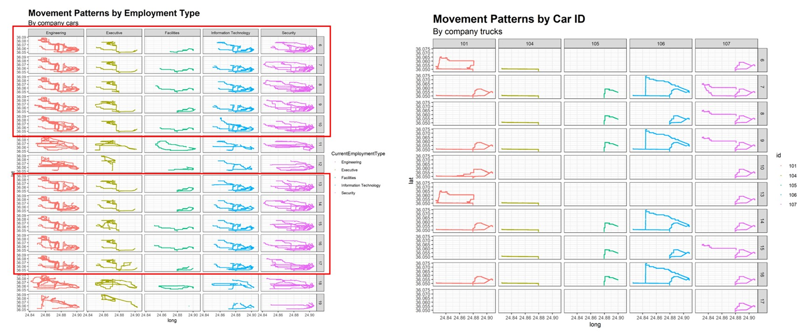{width=110%} 
*Fig2.1 Movement Patterns by Employment Type and Car ID*

Anomaly 1. Weekday anomalies. The working days are from Monday to Friday, alternatively speaking, January 6th to 10th and 13th to 17th. Almost all the cars and trucks showed similar driving path on weekdays. But the driving path for executives on 15th, facilities on 17th, 107 on 7th is different than usual.

Anomaly 2. Weekend anomalies. The weekend is January 11th, 12th, 18th and 19th. As company trucks were not used in these days, we only investigate the anomolies in company cars. Dislike weekdays, employees can drive cars to anywhere they want and from the graph, it doesn’t show similar patterns on these four days. But one thing is weird that on 19th January, Bertrand Ovan, staff who is the only missing facilities employees not belongs to truck drivers, didn’t go anywhere. Besides, information technology and security employees showed less frequent driving pattern on January 19th.

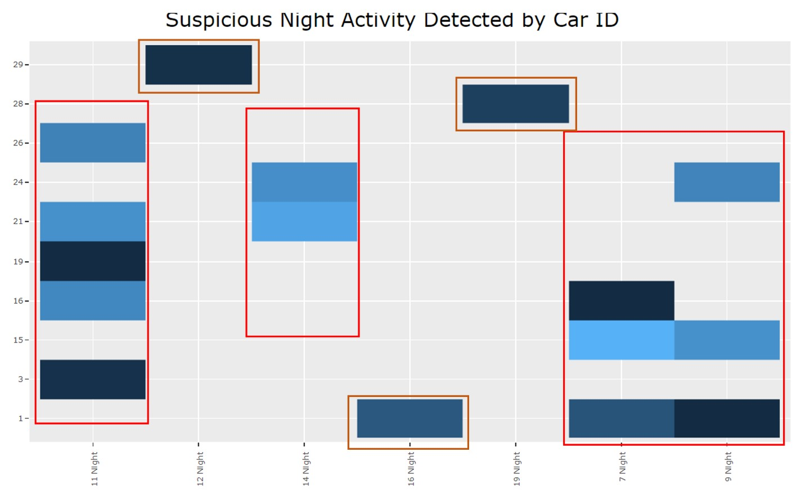{width=110%} 
*Fig2.2 Suspicious Night Activity Detected by Car ID*

Discrepancies between vehicle, credit and loyalty card data. I notice that there are 10 company cars had geospatial tracking data in the midnight (from 12am to 6am). There are 3 days, 7th, 11th, 14th, have more than one car driving path. 12th, 16th, and 19th have one car driving path. The result is a little bit different with analyzing credit and loyalty card data. Some car drivers may not buy anything when they go out, hence, only anlayzing expense records cannot notice these anomalies.

### 4.3 Question 3 

**Can you infer the owners of each credit card and loyalty card? What is your evidence? Where are there uncertainties in your method? Where are there uncertainties in the data? Please limit your answer to 8 images and 500 words.**

I infer the owners of each credit card and loyalty card by four steps.

```{r}
DT::datatable(cc_lyt)
```
*Fig3.1 Join Credit Card Table with Loyalty Card Table*

Step 1: Join credit card and loyalty card table together. As credit card table and loyalty card table have similar variables, I left join loyalty card table with credit card table and add a new column called “use_loyalty” to check whether employees used loyalty card when they make transactions.

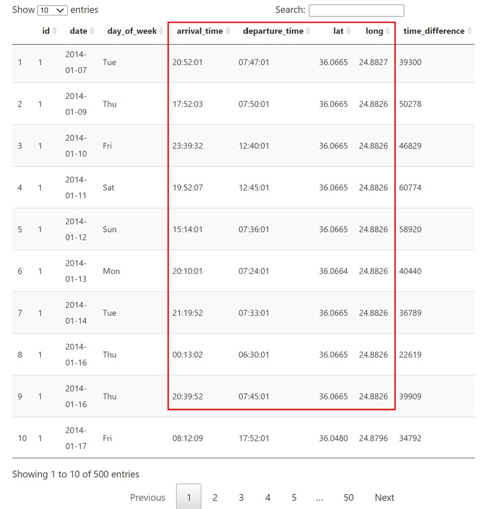{width=70%} 

*Fig3.2 Infer Home Address and Company Location*

Step 2: Create a new table to calculate the time difference employees stayed in one place. I assume that employees would stay at home more than five hours in the night. So I filter out time difference more than 18,000s (5 hours) to detect each employee’s home address. For example, in Fig3.2, we can infer (24.8796,36.0065) is the home of the owner of company car 1. For the same method, I find (24.8796,36.0480) is the location of GAStech company. In later discuss, we can filter out these data to make things easier, because stay at home or in the company should not be suspicious in most of the time.

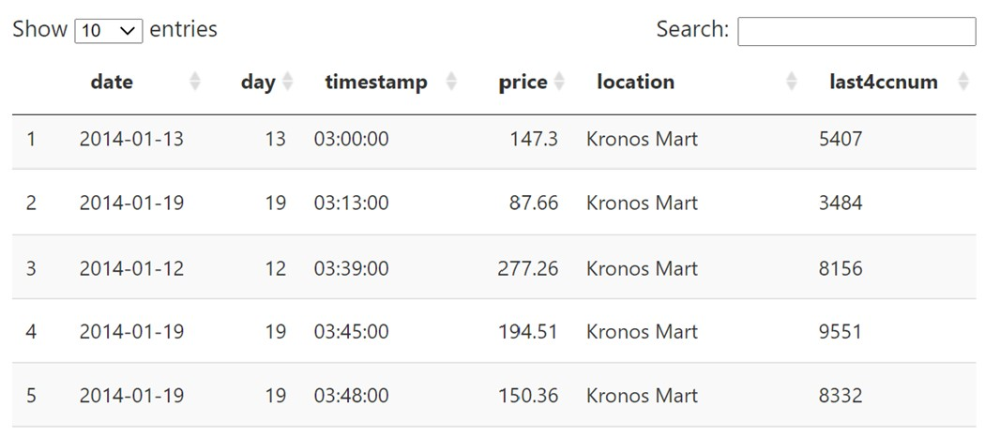{width=90%} 

*Fig3.3 Suspicious Transaction Time at midnight*

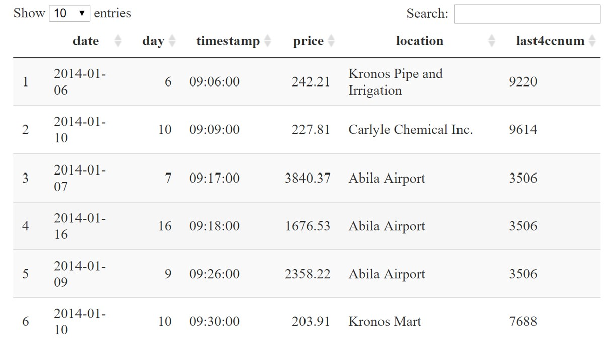{width=90%}

*Fig3.4 Suspicious Transaction Time at working hours*

Step 3: Detect suspicious transaction time from credit card. Suspicious transaction time I mentioned here has two parts. Firstly, the transaction made at midnight. Employees may sleep during midnight. If someone’s car didn’t park near their home and have some transaction records in credit card, that will be highly suspicious. Secondly, as I view the data in gps, I assume the working hours in GAStech is from 9 o’clock to 12 o’clock in the morning, 2 o’clock to 5 o’clock in the afternoon. During this time period, if they didn’t at office, it will be marked as suspicious.

Step 4: Use the suspicious time detected in step 3, filter the data in credit card and gps dataset, if the transaction time fall in the range of arrival time and departure time in the gps table, it will be a good match. Hence, I can infer the owner of the credit card and loyalty card in this way.


### 4.4 Question 4

**Given the data sources provided, identify potential informal or unofficial relationships among GASTech personnel. Provide evidence for these relationships. Please limit your response to 8 images and 500 words.**

### 4.5 Question 5

**Do you see evidence of suspicious activity? Identify 1- 10 locations where you believe the suspicious activity is occurring, and why Please limit your response to 10 images and 500 words.**

{width=90%} 

*Fig5.1 Suspicious Night Transactions by Credit Card*

Suspicious activity 1. I filter out the transaction records made at midnight. There are five transactions on 12th, 13th, and 19th. What I am curious about is all the credit card transactions at midnight are in the Kronos Mart. Does this store have special merchandise for sale? Or are these missing employees and suspects meeting at this place at midnight? 

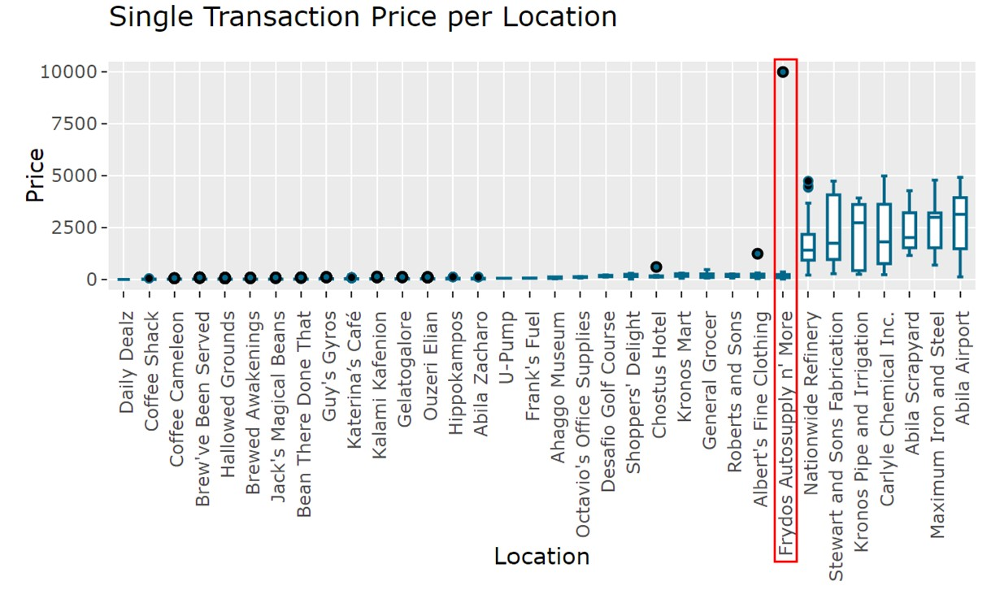{width=110%}

*Fig 5.2 Suspicious Transaction Money*

Suspicious Activity 2. An analysis of the transactions per employee reveals that Lucas Alcazar spent a large sum of money ($10,000) at Frydo's Autosupply n’ More. What products were bought in this transaction? 

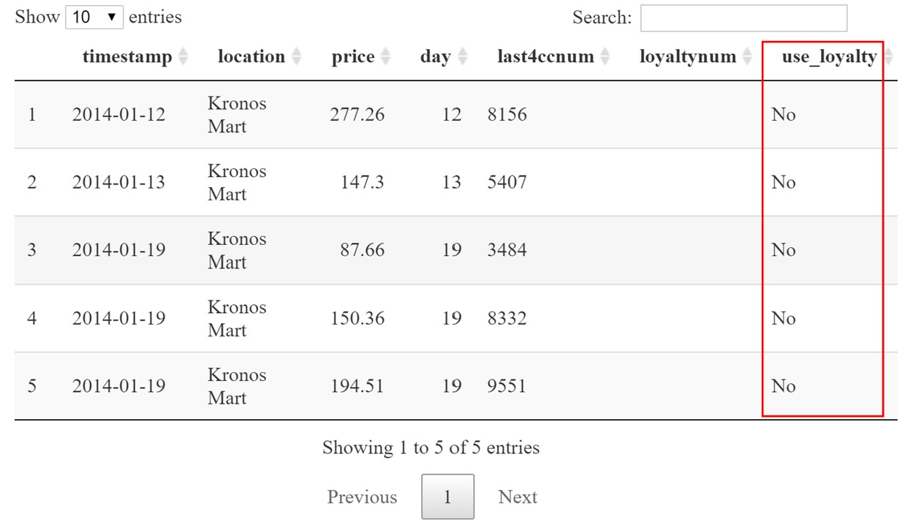{width=90%}

*Fig 5.3 Suspicious Night Transactions*

Suspicious activity 3. Here I filter out the night transactions made at Kronos Mart. All these five transactions didn’t use loyalty card. Were they afraid to record their peronsal information in their loyalty card? 

```{R}
tmap_mode("view")
tm_shape(bgmap) +
  tm_rgb(bgmap, r = 1,g = 2,b = 3,alpha = NA,saturation = 1,
       interpolate = TRUE,max.value = 255) +
  tm_shape(Abila_shape)+
  tm_lines(col= "grey", lwd=1)+
  tm_shape(gps_path_selected)+
  tm_dots()
```

*Fig 5.4 Place Employees Stayed More Than 5 Hours in the past 14 days*

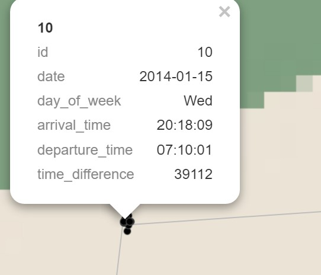{width=50%}

*Fig 5.6 Example of Clusters*

Fig 5.5 shows the locations where customers stayed more than 5 hours in a day. Fig 5.6 is the example of the home of the owner of car 10. In the Fig 5.5, if there are clusters with several dots in one place, I assume it is the home of the car owner.

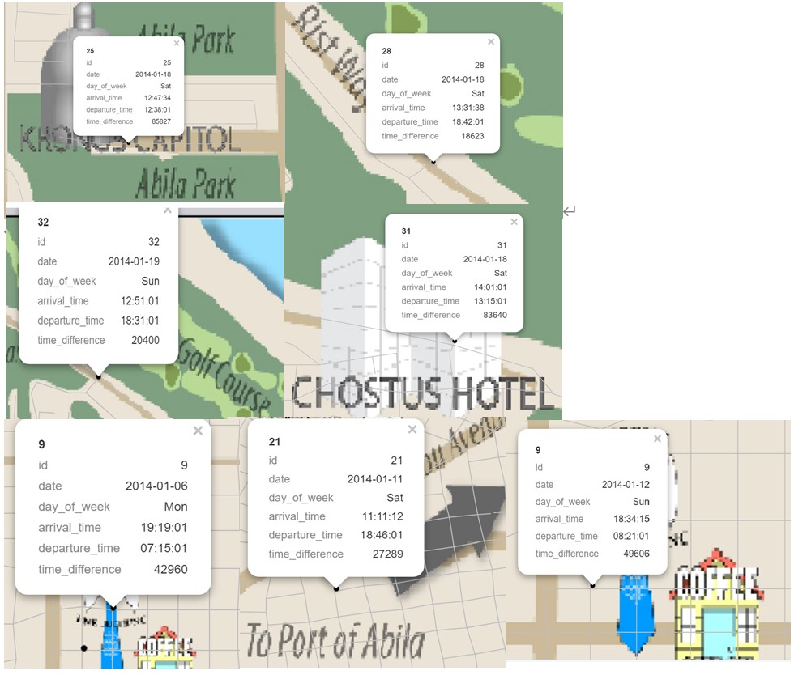{width=90%}

*Fig 5.7 Suspicious Location*

Suspicious activity 4. The above graph shows 7 suspicious places where employees stays more than 5 hours. Did they meet any others during the stay?
