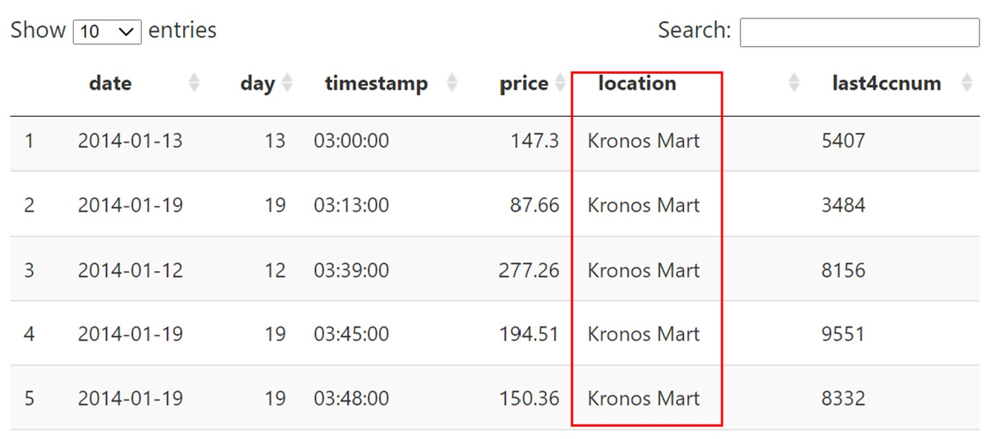

```{r setup, include=FALSE}
knitr::opts_chunk$set(fig.retina = 3,
                      echo = TRUE, message = FALSE, error = FALSE, 
                      warning = FALSE)
```

*Note: This is the solution for Q4 and Q5 of Vast Challenge MC2. To view solution for Q1, Q2 and Q3, please click here(https://linlizhong.netlify.app/posts/2021-07-25-assignment-mc2/)*

## 1. Overview
### 1.1 Background
GAStech is a natural gas production company in an island country of Kronos in the past twenty years. It builds strong relationships with the government of Kronos but low environment stewardship. In January 2014, when celebrating the success fortune by IPO (initial public offering), several employees of GAStech went missing. 

This post is focused on [VAST Challenge 2021 Mini-Challenge 2](https://vast-challenge.github.io/2021/MC2.html). Mini-Challenge 2 provides useful data of missing employees’ relevant information, a list of vehicle assignments by employee, vehicle tracking data, loyalty card transaction data, credit and debit card transaction data, and a tourist map of Abila. In this post, I will make use of R language to visual and analyze available data and identify the suspicious activity of the employees.

### 1.2 Literature review

The task of Mini Challenge 2 in 2014 was to find unusual patterns in employees’ daily lives from their credit/debit/loyalty card records and the GPS tracking records of their cars. In this article, I mainly refer to two works by Central South University and KU Leuven.

For Central South University, they used D3, MySQL, Excel as their visualization tools. They first identified daily routines for GAStech employees. They divided these missing employees into general staffs and truck drivers. Then they discuessed these two groups separately. They detected suspicious activities by visualization the credit card and gps data.

For KU Leuven, they had three stages to visualize. (1) Aggregate & Slice, (2) Design, Filter & Analyze and (3) Communicate. They first made full use of R to test their hypothesis. Then involved the design and implementation of streamlined tools to optimize the identification of specific patterns. After that, they presented and visualized the results.


## 2. Data Preparation
### 2.1 Install and load packages
The code chunk below is to check required packages are installed or not, if they are not installed, the code chunk will help install them automatically. After all packages are installed, the code chunk will load them.

```{r}
packages = c('igraph','ggraph','visNetwork','lubridate','dplyr',
             'clock','tidyverse','DataExplorer','gplots','plotly',
             'ggplot2','superheat','tm','plotly','lattice','GDAdata','raster',
             'sf','tmap','foreign','gifski','rgdal','tiff','sp','leaflet',"DT"
             )
for(p in packages){
  if(!require(p, character.only = T)){
  install.packages(p)
  }
  library(p,character.only = T)}
```

### 2.2 Import relevant data
The data is stored in MC2 file. Read_csv()is to import four csv files into R. "Windows-1252" is a single-byte character encoding of the Latin alphabet for value "Katerina’s Café".

```{r}
cc<- read_csv("MC2/cc_data.csv",locale = locale(encoding = "windows-1252"))
lyt<-read_csv("MC2/loyalty_data.csv",locale = locale(encoding = "windows-1252"))
gps <-read_csv("MC2/gps.csv")
car<-read_csv("MC2/car-assignments.csv")
```

### 2.3 Data preparation

**1. Change data type.** The code chunk below is to convert id in gps from number to factor, last4ccnum in cc from number to character and timestamp in gps, loyalty, and credit card from character data type to Datetime format.

```{R}
gps$id<-as.factor(gps$id)
car$CarID<-as.factor(car$CarID)
cc$last4ccnum<-as.character(cc$last4ccnum)
gps$Timestamp<-date_time_parse(gps$Timestamp,zone = "",format = "%m/%d/%Y %H:%M:%S")
lyt$timestamp<-date_time_parse(lyt$timestamp,zone = "",format = "%m/%d/%Y")
cc$timestamp<-date_time_parse(cc$timestamp,zone = "",format = "%m/%d/%Y %H:%M")
```

**2. Combine data.** The code chunk below is to combine first name and last name of employee together in the list of car.

```{r}
car$Name<-paste(car$FirstName,car$LastName)
```

**3. Add additional column.** When analyzing the car assignment csv file, we may notice that the GAStech does not assign specific company truck for each truck driver, but this is not a case for other employees with title which is not truck driver. Hence, we can divide missing employees into two types, one is general employees, another one is truck driver, to further investigate their suspicious activities. Besides, add additional column for car type, and there are two types of cars, one for company truck another one for company car.

```{r}
car$Category<-ifelse(car$CurrentEmploymentTitle == "Truck Driver", 
                       "Truck Driver","General Staff")
gps$car_type<-ifelse(gps$id %in% c('101','104','105','106','107'),'Company truck',
                     'company car')
```

The code chunk below is to extract day of the timestamp and add it in column called "day" in each file.

```{r}
cc$day<-get_day(cc$timestamp)
lyt$day<-get_day(lyt$timestamp)
gps$day<-get_day(gps$Timestamp)
```

The code chunk below is the first part of vast challenge. 

```{r}
#Import raster file
bgmap <- raster("MC2/Geospatial/MC2-tourist.tif")
# import the Abila shapefile
Abila_layout <- "MC2/Geospatial/Abila.shp"
Abila_shape <- readOGR(Abila_layout)

#Import GIS data file
Abila_st <- st_read(dsn = "MC2/Geospatial",
                    layer = "Abila")
```


## 3. MC2 Visualization Preparation
### 3.4 Question 4 

**Given the data sources provided, identify potential informal or unofficial relationships among GASTech personnel. Provide evidence for these relationships. Please limit your response to 8 images and 500 words.**

```{r}
gps_track <- read_csv("MC2/gps.csv")
gps_track$id<-as.factor(gps$id)
gps_track$Timestamp<-date_time_parse(gps_track$Timestamp,zone = "",
                                     format = "%m/%d/%Y %H:%M:%S")
gps4<- gps_track
gps4<- dplyr::rename(gps4, arrival_time = Timestamp)
gps4$date<-as.Date(format(gps4$arrival_time, "%Y-%m-%d"))
gps4$day_of_week<-wday(gps4$arrival_time, label=TRUE)
gps4 <- gps4[order(gps4$id,gps4$date,gps4$arrival_time), ]
gps4 <- gps4 %>%
  group_by(id) %>%
  mutate(departure_time = lead(arrival_time))%>%
  mutate(time_difference = departure_time - arrival_time)%>%
  filter(time_difference >= 60 & time_difference <= 18000 )
gps4$arrival_time<-format(as.POSIXct(gps4$arrival_time), format = "%H:%M:%S")
gps4$departure_time<-format(as.POSIXct(gps4$departure_time), format = "%H:%M:%S")

gps5<-gps4%>%
  relocate(id,date,day_of_week,arrival_time,departure_time,lat,long,time_difference)
```

```{r}
gps6<-gps5%>%
  filter(id != "107"& id != "106"&id != "105"&
         id != "104"&id != "101")
gps6<-merge(x = gps6, y = car[ , c("Name", "CarID")], 
            by.x='id', by.y='CarID')

gps6<-gps5%>%
  filter(id != "107"& id != "106"&id != "105"&
         id != "104"&id != "101")
gps6<-merge(x = gps6, y = car[ , c("Name", "CarID")], 
            by.x='id', by.y='CarID')
gps_sf <- st_as_sf(gps6, coords = c("long", "lat"),crs= 4326)
#Creating movement path from GPS points
gps_path <- gps_sf %>%
  group_by(Name, id, date,day_of_week,time_difference,arrival_time,departure_time)
gps_path_selected2 <- gps_path 
tmap_mode("view")
map<-tm_shape(bgmap) +
  tm_rgb(bgmap, r = 1,g = 2,b = 3,alpha = NA,saturation = 1,
       interpolate = TRUE,max.value = 255) +
  tm_shape(Abila_shape)+
  tm_lines(col= "grey", lwd=1)+
  tm_shape(gps_path_selected2)+
  tm_dots() +
  tm_facets(by = "date",ncol = 2)
```


### 3.5 Question 5 

**Do you see evidence of suspicious activity? Identify 1- 10 locations where you believe the suspicious activity is occurring, and why Please limit your response to 10 images and 500 words.**

```{r}
p4<-plot_ly(data = cc, x = ~day, y=~price, marker = list(color = 'rgb(158,202,225)',
                           line = list(color = 'rgb(8,48,107)', width = 1.5)))
p4 <- p4 %>% layout(title = "Total price per day by credit card",
                                      xaxis = list(title = "Day"),
                                      yaxis = list(title = "Total price"))

p5<-plot_ly(data = lyt, x = ~day, y=~price, marker = list(color = 'rgb(158,202,225)',
                           line = list(color = 'rgb(8,48,107)', width = 1.5)))
p5<- p5 %>% layout(title = "Total price per day by loyalty card",
                                      xaxis = list(title = "Day"),
                                      yaxis = list(title = "Total price"))
p4
p5
```

```{r}
p6<-ggplot(cc, aes(x = reorder(location,price), y=price)) + 
    geom_boxplot(color = "deepskyblue4")+
    theme(axis.text.x = element_text(angle = 90, hjust = 1))+
    labs(title = "Single Transaction Price per Location",
             x = "Location", y = "Price")
ggplotly(p6)
```


## 4. MC2 Visualization Insights

### 4.4 Question 4

**Given the data sources provided, identify potential informal or unofficial relationships among GASTech personnel. Provide evidence for these relationships. Please limit your response to 8 images and 500 words.**

Because of limited time and efforts, I choose "2014-01-07" as an example to show the unofficial relationships among GAStech personnel. In this file we can find out who is in clusters in the same place then infer they may have unoffical relationships with each other.

```{r}
gps_path <- gps_sf %>%
  group_by(Name, id, date,day_of_week,time_difference,arrival_time,departure_time)
gps_path_selected2 <- gps_path %>%
  filter(date == "2014-01-11")
tmap_mode("view")
tm_shape(bgmap) +
  tm_rgb(bgmap, r = 1,g = 2,b = 3,alpha = NA,saturation = 1,
       interpolate = TRUE,max.value = 255) +
  tm_shape(Abila_shape)+
  tm_lines(col= "grey", lwd=1)+
  tm_shape(gps_path_selected2)+
  tm_dots() 
```


### 4.5 Question 5

**Do you see evidence of suspicious activity? Identify 1- 10 locations where you believe the suspicious activity is occurring, and why Please limit your response to 10 images and 500 words.**

{width=90%} 